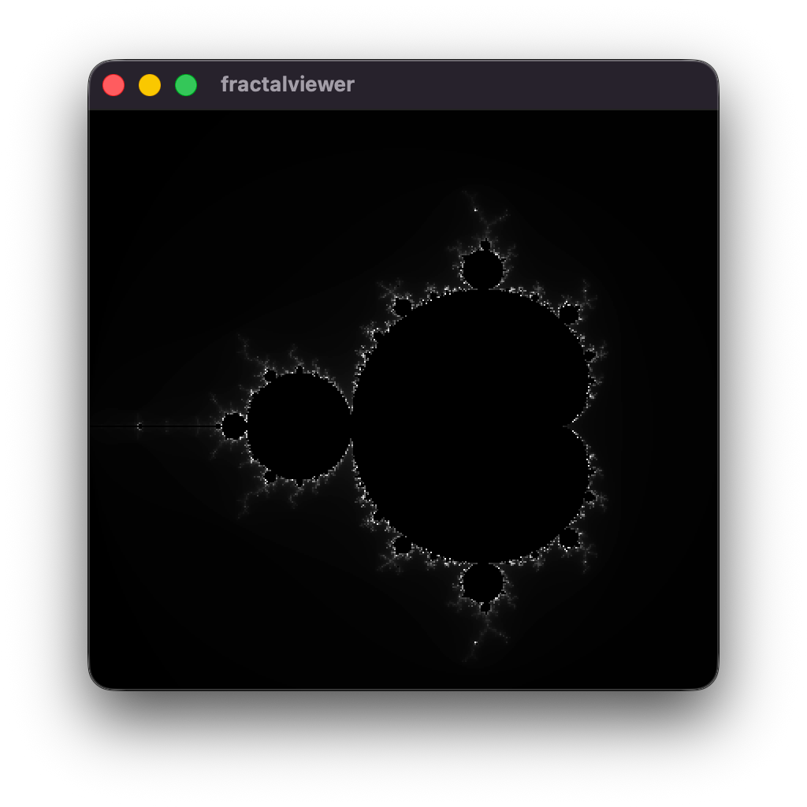
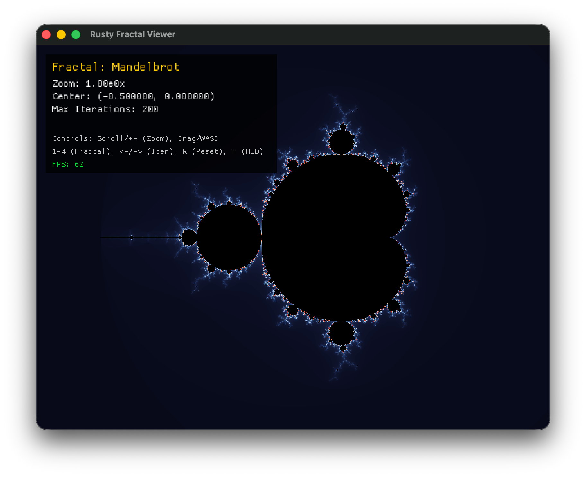

### V1: Initial Port & Basic Escape-Time Calculation

#### Description
Ported the initial escape-time rendering algorithm from C++ to Rust using Macroquad. Basic Mandelbrot set rendering with initial color mapping.

### V2: Smooth Color Palettes & Linear Interpolation

#### Description
Implemented `lerp_color` and `smooth_color` functions alongside dynamic palette rendering, producing smooth gradient color stops across iterations.

Refactored design around the `Fractal` trait. Integrated support for multiple escape-time fractals:
- Mandelbrot Set
- Julia Set
- Burning Ship Fractal
- Tricorn (Mandelbar) Fractal

Added interactive camera controls:
- Smooth cursor-anchored mouse wheel zooming (`zoom_at`).
- Click-and-drag panning.
- Dynamic window resolution recalculation & HUD overlay.
